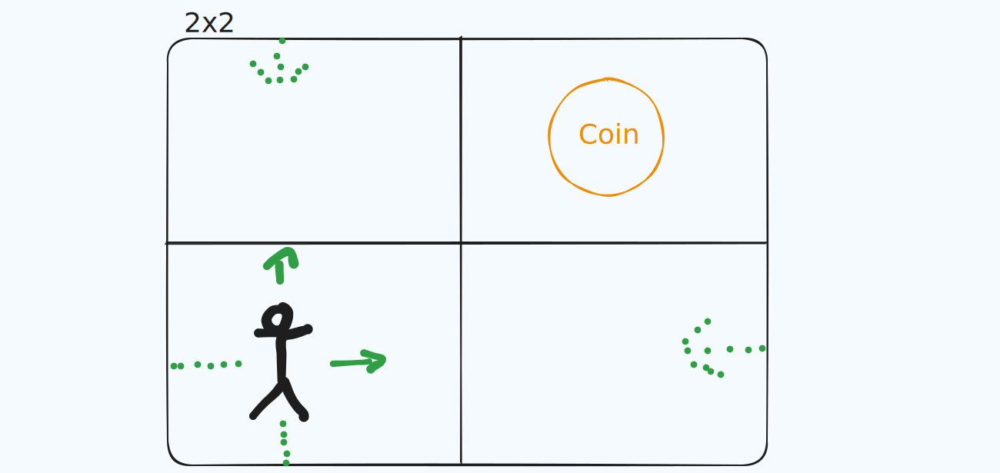

# Gamble Coin - (aka. Random Walk Coin or RW-Coin)

The by far worst Crypto Currency on the market.

## Idea

Every Player can select a tile they want to spawn for this gambling cycle.
They now can move x steps in any direction, f.e `{1: "North", 2: "East"}`.
If they land on a coin, the coin for this iteration belongs to them and they are super rich.
If they dont land on a coin, they need to spawn anew and walk again.
Every walk will cost walk tokens that need to be buyed beforehand at my authority.
Walking over edges lets so change the Sides of the playfield and cost no extra tokens.
Every new player increases the dimension of the playfield by 1, which leads following numbers:

- 1 Player: 2x2 Field
- 2 Players: 3x3 Field
- 4 Players: 5x5 Field
- 10 Players: 11x11 Field
- ...

Every coin is active in the playfield until a player finds it.
Different walking strategies can compete against each other.

A Request for a walk request can look like following:

```json
POST
http://<backendurl>/walk
{  
    "start": {"x": 0, "y": 0}, 
    "walks" {"1": "N", "2": "E"}
}
```

The amount of maximum steps per request can be changed by the host for a fair match.


